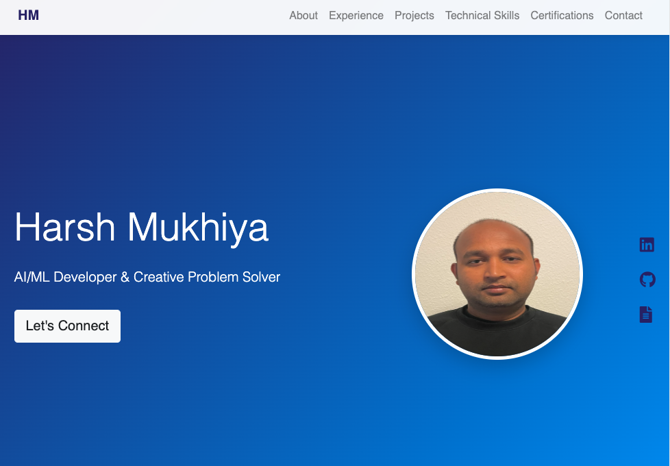

# Harsh Mukhiya - AI/ML Developer Portfolio

[](https://opensource.org/licenses/MIT)
[](https://getbootstrap.com/)
[](https://michalsnik.github.io/aos/)




A modern, responsive portfolio website showcasing AI/ML development expertise and full-stack capabilities.


## Live Demo
Visit my portfolio website: [https://ha981muk-git.github.io/](https://ha981muk-git.github.io/)

## Features

- 🚀 **Modern UI Design** with smooth animations
- 📱 **Fully Responsive** across all devices
- 💻 **Interactive Sections**:
  - Professional Experience Timeline
  - Project Showcase with GitHub Links
  - Skill Matrix Visualization
  - Certification Gallery
- 📨 **Contact Form** with Formspree Integration
- 🌓 **Dark Mode Support** (toggle implementation available)
- 📊 **Analytics Integration** with Google Tag Manager

## Technologies Used

- **Frontend**: HTML5, CSS3, JavaScript
- **Frameworks**: Bootstrap 5, AOS (Animate On Scroll)
- **Icons**: Font Awesome 5
- **Form Handling**: Formspree
- **Build Tools**: CDN-based dependencies

## Installation

1. Clone the repository:
```bash
git clone https://github.com/ha981muk-git/ha981muk-git.github.io.git

```
